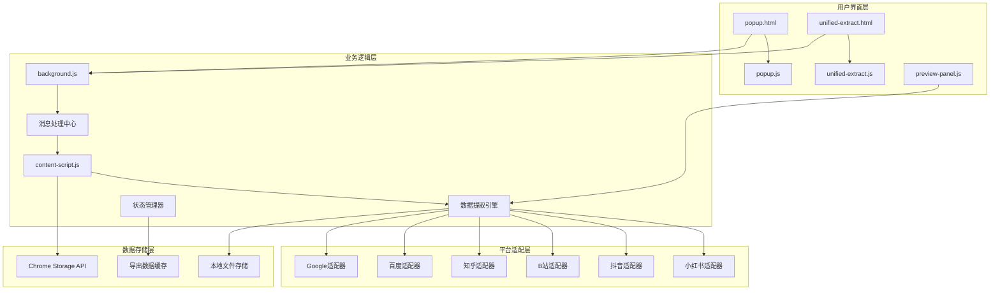
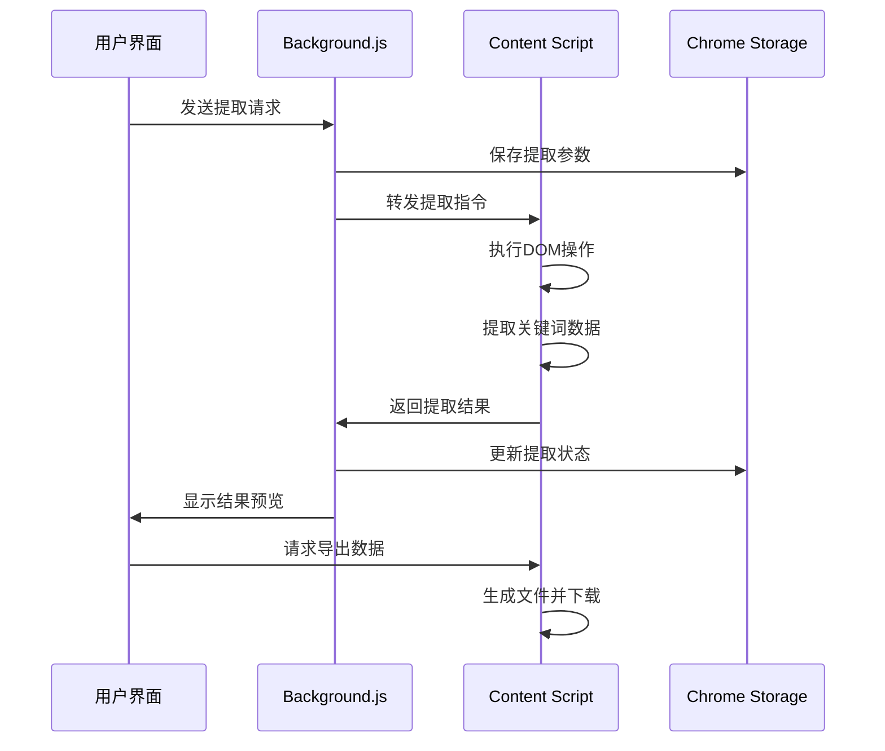

# 搜索推荐词采集与内容生成助手

一个强大的Chrome浏览器扩展，支持从小红书、抖音、B站、知乎、百度、Google等平台提取搜索推荐词，并提供ChatGPT自动化内容生成功能。

## ✨ 主要功能

### 🔍 搜索推荐词提取
- **多平台支持**：小红书、抖音、B站、知乎、百度、Google
- **多级提取**：支持1-3级关键词深度采集
- **智能占位符**：支持`{c}`占位符自动替换为A-Z进行批量搜索
- **实时预览**：采集过程中实时显示结果预览

### 📊 数据导出功能
- **CSV格式**：结构化数据导出，便于后续分析
- **思维导图**：Markdown格式的层级思维导图
- **即时下载**：采集完成后自动下载到本地

### 🤖 ChatGPT集成
- **自动化内容生成**：基于采集的关键词自动生成文章
- **批量处理**：支持多个关键词的批量内容创建
- **状态管理**：实时跟踪生成进度和状态
- **内容发布**：支持生成内容的自动发布

### 🎨 用户体验
- **统一界面**：现代化的用户界面设计
- **实时反馈**：操作状态实时显示
- **响应式设计**：适配不同屏幕尺寸
- **配置灵活**：支持自定义采集参数

## 🚀 快速开始

### 安装扩展
1. 下载或克隆项目到本地
2. 打开Chrome扩展管理页面 (`chrome://extensions/`)
3. 开启"开发者模式"
4. 点击"加载已解压的扩展程序"
5. 选择项目根目录

### 基础使用
1. 点击浏览器工具栏中的扩展图标
2. 输入要采集的关键词（支持多行输入）
3. 选择采集层级（1-3级）
4. 点击"提取推荐词"开始采集
5. 查看结果并导出为CSV或思维导图格式

## 📖 详细文档

- [安装指南](docs/INSTALLATION.md) - 详细的安装步骤和配置说明
- [使用说明](docs/USAGE.md) - 完整的使用教程和高级功能介绍
- [开发者文档](docs/DEVELOPMENT.md) - 技术架构和开发指南
- [代码示例](docs/CODE_EXAMPLES.md) - 代码示例和配置示例
- [故障排除](docs/TROUBLESHOOTING.md) - 常见问题解决方案和调试方法

## 🛠 技术架构

### 数据流设计

## 📋 更新日志

### v1.3 (当前版本)
- ✨ 新增统一提取界面
- 🎨 优化用户界面设计
- 🔧 改进关键词提取算法
- 📱 增强响应式设计支持
- 🐛 修复已知的稳定性和兼容性问题

## 🤝 贡献指南

欢迎提交Issue和Pull Request来改进这个项目！

## 📄 许可证

本项目采用 MIT 许可证 - 查看 [LICENSE](LICENSE) 文件了解详情。

## 📞 联系方式

如有问题或建议，请通过以下方式联系：
- 提交GitHub Issue
- 发送邮件至：niemingxing@example.com

---

**注意**：本扩展仅用于合法的数据采集和分析用途，请遵守各平台的使用条款和相关法律法规。