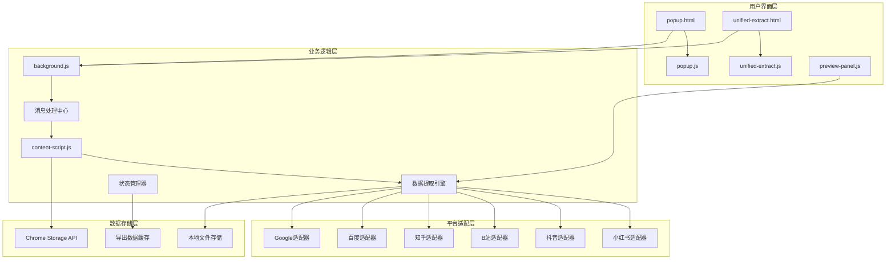
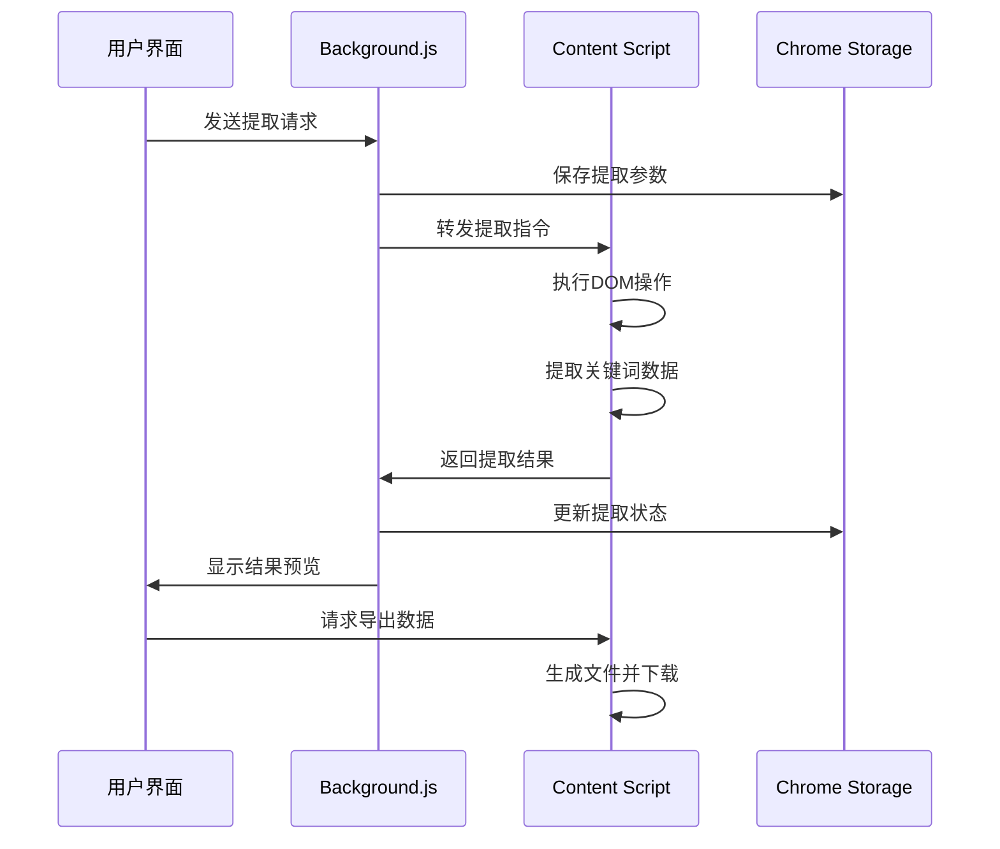

# 开发者文档

本文档面向开发者，提供搜索推荐词采集助手的技术架构、开发指南和API参考。

## 🏗️ 系统架构

### 整体架构图



### 核心模块详解

#### 1. background.js - 背景服务
- **消息处理中心**：处理所有扩展内部消息传递
- **标签页管理**：控制采集标签页的创建和销毁
- **数据转发**：在content-script和popup之间传递数据
- **状态管理**：维护扩展运行状态

#### 2. content-script.js - 内容脚本
- **DOM操作**：在各平台页面执行DOM查询和操作
- **关键词提取**：实现各平台的推荐词提取算法
- **事件模拟**：模拟用户输入和搜索行为
- **数据处理**：处理和格式化采集数据

#### 3. 统一界面系统
- **popup.js**：传统弹窗界面逻辑
- **unified-extract.js**：统一提取界面
- **preview-panel.js**：预览面板组件

## 📡 消息传递机制

### 消息类型定义
```javascript
// 消息类型枚举
const MESSAGE_TYPES = {
    // 提取相关
    COLLECT_SEARCH_KEYWORDS: 'collect_search_keywords',
    CHATGPT_CREATE_ARTICLE: 'chatgpt_create_article',
    
    // 数据相关
    PREVIEW_DATA: 'preview_data',
    EXPORT_CSV: 'export_csv',
    EXPORT_MINDMAP: 'export_mindmap',
    
    // 状态相关
    INIT_SETTING: 'init_setting',
    UPDATE_STATUS: 'update_status',
    
    // UI相关
    SHOW_PREVIEW_PANEL: 'show_preview_panel',
    POPUP_STILL_OPEN: 'popup_still_open'
};
```

### 消息流程图



## 🔧 平台适配器

### 适配器接口定义
```javascript
class PlatformAdapter {
    constructor(domain) {
        this.domain = domain;
    }
    
    // 获取搜索框元素
    getSearchInput() {
        throw new Error('Method not implemented');
    }
    
    // 获取推荐词元素
    getRecommendElements() {
        throw new Error('Method not implemented');
    }
    
    // 输入搜索内容
    inputSearch(query) {
        throw new Error('Method not implemented');
    }
}
```

### 平台选择器配置
```javascript
const PLATFORM_SELECTORS = {
    'douyin.com': {
        search: 'header input[data-e2e="searchbar-input"]',
        recommend: 'header div[data-index]'
    },
    'xiaohongshu.com': {
        search: '.search-input',
        recommend: 'div.sug-item'
    },
    'bilibili.com': {
        search: '.nav-search-input',
        recommend: 'div.suggestions div.suggest-item'
    },
    'zhihu.com': {
        search: 'form.SearchBar-tool input[type=text]',
        recommend: 'div.Menu-item'
    },
    'baidu.com': {
        search: '#kw',
        recommend: 'ul li.bdsug-overflow'
    },
    'google.com': {
        search: 'form[role="search"] textarea',
        recommend: 'ul[role="listbox"] li[role="presentation"] div[role="option"] div[role="presentation"]:first-child'
    }
};
```

## 💾 数据存储设计

### Chrome Storage 结构
```javascript
// 存储键值定义
const STORAGE_KEYS = {
    SETTING: 'setting',              // 用户设置
    KEYWORDS: 'keywords',            // 关键词历史
    CURRENT_EXTRACTION: 'current_extraction',  // 当前提取任务
    ACTIVE_TAB_ID: 'active_tab_id',  // 活动标签页ID
    PGA_KEYWORDS_DOLIST: 'pga_keywords_dolist'  // ChatGPT关键词列表
};

// 设置数据结构
interface SettingData {
    level: number;                   // 采集层级
    create_prompt?: string;          // ChatGPT提示词模板
    export_format?: string;          // 导出格式
}

// 提取任务数据结构
interface ExtractionData {
    keywords: string;               // 关键词
    level: number;                  // 采集层级
    type: string;                   // 任务类型
    timestamp: number;              // 时间戳
    status: string;                 // 任务状态
    result?: PreviewData;           // 结果数据
}

// 预览数据结构
interface PreviewData {
    level: number;                  // 采集层级
    keywords: Array<[number, string]>; // 关键词数组 [层级, 关键词]
}
```

## 🎯 关键算法

### 1. 关键词采集算法
```javascript
async function collectSearchKeywords(data) {
    // 1. 解析输入关键词
    const keywordList = parseKeywords(data.keywords);
    
    // 2. 处理占位符
    const expandedKeywords = expandPlaceholders(keywordList);
    
    // 3. 逐个关键词采集
    for (const keyword of expandedKeywords) {
        await search(keyword);
    }
    
    // 4. 发送预览数据
    sendPreviewData();
}
```

### 2. 多级采集算法
```javascript
async function search(query) {
    // 1. 执行搜索
    await performSearch(query);
    
    // 2. 提取一级推荐词
    const level1Keywords = await extractLevel1Keywords();
    
    // 3. 如果需要二级采集
    if (collectLevel >= 2) {
        for (const keyword of level1Keywords) {
            const level2Keywords = await extractKeywords(keyword);
            
            // 4. 如果需要三级采集
            if (collectLevel >= 3) {
                for (const keyword2 of level2Keywords) {
                    await extractKeywords(keyword2);
                }
            }
        }
    }
}
```

### 3. 状态管理算法
```javascript
function updateKeywordsListItemElement(key, data) {
    // 1. 查找或创建列表项
    let itemElement = findOrCreateListItem(key);
    
    // 2. 更新状态显示
    const statusElement = itemElement.querySelector('.gpt-sr-status');
    statusElement.textContent = data.status_text;
    
    // 3. 更新状态样式
    updateStatusStyle(statusElement, data.status);
    
    // 4. 更新操作按钮状态
    updateActionButtons(itemElement, data.status);
    
    // 5. 更新统计信息
    updateStatistics();
}
```

## 🛠️ 开发环境设置

### 1. 环境要求
- Node.js 14+
- Chrome 88+
- 代码编辑器（推荐VS Code）

### 2. 开发工具
```bash
# 安装开发依赖
npm install

# 启动开发模式
npm run dev

# 构建生产版本
npm run build

# 运行测试
npm test
```

### 3. 调试方法

#### 背景脚本调试
1. 打开扩展管理页面
2. 点击"service worker"链接
3. 在开发者工具中调试

#### 内容脚本调试
1. 在目标页面按F12
2. Console中查看日志
3. Sources中调试脚本

#### 弹窗调试
1. 右键点击扩展图标
2. 选择"检查"
3. 在弹出的开发者工具中调试

## 📝 代码规范

### 1. 命名规范
- 使用驼峰命名法
- 常量使用大写字母和下划线
- 函数名使用动词开头
- 私有变量使用下划线前缀

### 2. 代码结构
```javascript
// 文件头部注释
/**
 * 文件功能描述
 * @author 作者
 * @date 创建日期
 */

// 使用严格模式
'use strict';

// 常量定义
const CONSTANT_NAME = 'value';

// 主要功能函数
function mainFunction() {
    // 函数实现
}

// 导出模块
module.exports = { mainFunction };
```

### 3. 错误处理
```javascript
try {
    // 可能出错的代码
    riskyOperation();
} catch (error) {
    console.error('操作失败:', error);
    
    // 发送错误报告
    sendErrorReport(error);
    
    // 恢复默认状态
    restoreDefaultState();
}
```

## 🧪 测试指南

### 1. 单元测试
```javascript
// 测试文件命名：*.test.js
describe('关键词采集功能', () => {
    test('应该正确解析关键词', () => {
        const input = '关键词1\\n关键词2';
        const result = parseKeywords(input);
        expect(result).toEqual(['关键词1', '关键词2']);
    });
});
```

### 2. 集成测试
```javascript
describe('平台适配器测试', () => {
    test('应该正确获取搜索框', async () => {
        const adapter = new PlatformAdapter('baidu.com');
        const element = adapter.getSearchInput();
        expect(element).toBeTruthy();
    });
});
```

### 3. 端到端测试
```javascript
describe('完整采集流程测试', () => {
    test('应该完成完整的采集流程', async () => {
        // 模拟用户操作
        await userInputKeywords();
        await clickExtractButton();
        
        // 验证结果
        const result = await getExtractionResult();
        expect(result.keywords.length).toBeGreaterThan(0);
    });
});
```

## 🚀 部署指南

### 1. 版本管理
```bash
# 更新版本号
npm version patch/minor/major

# 构建发布版本
npm run build

# 打包扩展
npm run package
```

### 2. 发布流程
1. 更新CHANGELOG.md
2. 创建git标签
3. 构建生产版本
4. 上传到Chrome商店
5. 发布release notes

## 📚 API参考

### 核心API

#### `chrome.runtime.sendMessage`
发送消息到背景脚本。

**参数：**
- `message` - 消息对象
- `callback` - 回调函数

**示例：**
```javascript
chrome.runtime.sendMessage({
    type: 'collect_search_keywords',
    keywords: '测试关键词',
    level: 2
}, function(response) {
    console.log('响应:', response);
});
```

#### `chrome.storage.local`
本地存储API。

**方法：**
- `get(keys, callback)` - 获取数据
- `set(items, callback)` - 设置数据
- `remove(keys, callback)` - 删除数据

**示例：**
```javascript
// 保存设置
chrome.storage.local.set({
    'setting': {
        level: 2,
        export_format: 'csv'
    }
});

// 读取设置
chrome.storage.local.get('setting', function(data) {
    console.log('设置:', data.setting);
});
```

### 工具函数

#### `inputDispatchEventEvent`
模拟用户输入事件。

**参数：**
- `element` - DOM元素
- `value` - 输入值

**示例：**
```javascript
const searchInput = document.querySelector('#kw');
inputDispatchEventEvent(searchInput, '搜索关键词');
```

#### `downloadCSV`
下载CSV文件。

**参数：**
- `content` - CSV内容
- `filename` - 文件名

**示例：**
```javascript
const csvContent = '层级,关键词\\n1,测试关键词';
downloadCSV(csvContent, 'keywords.csv');
```

## 🤝 贡献指南

### 1. 提交规范
```bash
# 功能开发
git checkout -b feature/new-feature
git commit -m "feat: 添加新功能"

# Bug修复
git checkout -b fix/bug-fix
git commit -m "fix: 修复问题"

# 文档更新
git checkout -b docs/update-docs
git commit -m "docs: 更新文档"
```

### 2. 代码审查
- 遵循代码规范
- 添加必要的注释
- 确保测试通过
- 更新相关文档

---

如有技术问题，请提交Issue或联系开发团队。